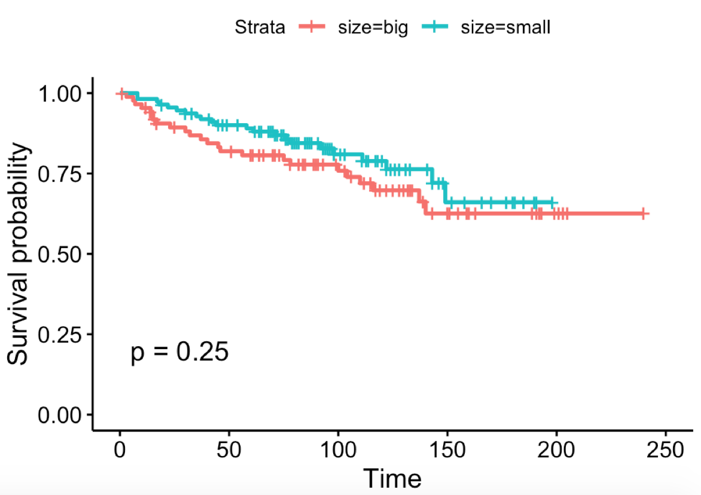
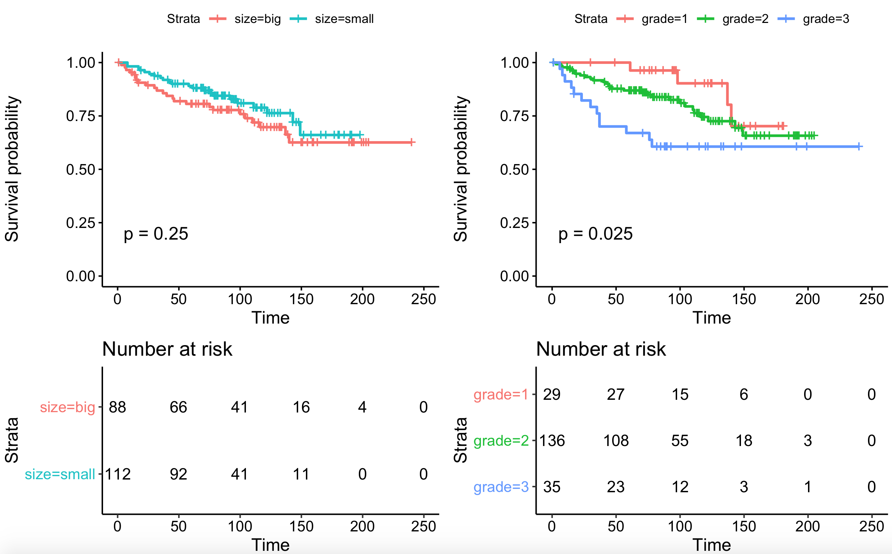

# 演示生存分析

选择这个数据集，主要是为了演示生存分析的操作，尤其是批量对所有基因的表达量进行分组后的生存分析，包括KM和COX的。

代码很简单， 同样是使用GEOquery包下载数据集，然后提取生存分析相关的表型信息，如下：

```
> head(phe)
  event grade node  size time
1     1     2    0 small   92
2     0     3    0   big   71
3     1     3    0 small   58
4     0     2    0 small   68
5     0     2    0   big  103
6     0     2    0 small   93
```

有了表型数据，即可做生存分析，这个时候并不需要表达矩阵，因为不需要根据基因进行分组：

```r
library(survival)
library(survminer)
# 利用ggsurvplot快速绘制漂亮的生存曲线图
sfit <- survfit(Surv(time, event)~size, data=phe)
sfit
summary(sfit)
ggsurvplot(sfit, conf.int=F, pval=TRUE)
```

可以看到 size 这个临床表型，跟病人生存的关系并不显著。



然后我们联合多个表型合并绘制生存分析曲线：

```r
## 多个 ggsurvplots作图生存曲线代码合并代码公布
sfit1=survfit(Surv(time, event)~size, data=phe)
sfit2=survfit(Surv(time, event)~grade, data=phe)
splots <- list()
splots[[1]] <- ggsurvplot(sfit1,pval =TRUE, data = phe, risk.table = TRUE)
splots[[2]] <- ggsurvplot(sfit2,pval =TRUE, data = phe, risk.table = TRUE)
# Arrange multiple ggsurvplots and print the output
arrange_ggsurvplots(splots, print = TRUE,  ncol = 2, nrow = 1, risk.table.height = 0.4)
# 可以看到grade跟生存显著相关，而size病人生存的关系并不显著。
```

如图：



针对全部基因进行分组后批量走生存分析，代码见 [step5-survival.R](./step5-survival.R) 希望你可以抽出10个小时以上时间弄懂我的代码，应用到你的数据集。